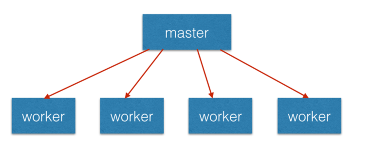

# node如何管理多线程

nodejs是在主线程执行的，其他的异步IO和事件驱动相关的线程是通过libuv来实现内部的线程池和线程调度的。libuv存在着一个Event Loop,通过 Event Loop（事件循环）来切换实现类似多线程的效果。Event Loop 是维持一个执行栈和一个事件队列，在执行栈中，如果有异步IO及定时器等函数的话，就把这些异步回调函数放入到事件队列中。等执行栈执行完成后，会从事件队列中，按照一定的顺序执行事件队列中的异步回调函数。

nodeJS中的单线程是指js引擎只在唯一的主线程上运行的。其他的异步操作是有独立的线程去执行。通过libuv的Event Loop实现了类似多线程的上下文切换以及线程池的调度。线程是最小的进程，因此node也是单进程的。

## NodeJS的实现多进程架构

如上第四点，面对单线程单进程对多核使用率不好的问题，因此我们使用多进程，每个进程使用一个cpu，因此我们就可以实现多核cpu的利用。
Node提供了child_process模块和cluster模块来实现多进程以及进程的管理。也就是我们常说的 Master-Worker模式。也就是说进程分为Master(主)进程 和 worker（工作）进程。master进程负责调度或管理worker进程，那么worker进程负责具体的业务处理。在服务器层面来讲，worker可以是一个服务进程，负责出来自于客户端的请求，多个worker就相当于多个服务器，因此就构成了一个服务器群。master进程则负责创建worker，接收客户端的请求，然后分配到各个服务器上去处理，并且监控worker进程的运行状态及进行管理操作。

如下图所示：

上创建了4个worker进程后，现在我们需要考虑的是如何实现`master`进程与`worker`进程通信的问题。

在NodeJS中父子进程之间通信可以通过 `on('message')` 和 `send()`方法来实现通信，`on('message')` 是监听`message`事件的。

当该进程收到其他进程发送的消息时候，便会触发`message`事件。`send()`方法则是用于向其他进程发送消息的。

[原文链接](https://www.cnblogs.com/tugenhua0707/p/11141076.html)