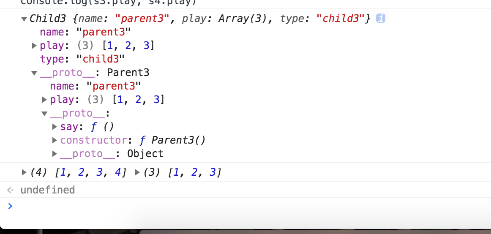
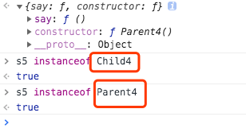

# 继承实现的几种方式

## 借助构造函数实现继承

```
function Parent1() {
   this.name = 'parent1';
 }
 
 Parent1.prototype.say = function () {}
 
 function Child1() {
   Parent1.call(this);
   this.type = 'child';
 }

 console.log(new Child1);
```
打印结果


这个主要是借用`call` 来改变`this`的指向，通过 `call` 调用`Parent`，此时 `Parent` 中的 `this` 是指 `Child1`。有个缺点，从打印结果看出 `Child1`并没有`say`方法，所以这种只能继承父类的实例属性和方法，不能继承原型属性/方法。

## 借助原型链实现继承

```
/**
 * 借助原型链实现继承
 */
function Parent2() {
  this.name = 'parent2';
  this.play = [1, 2, 3];
}

function Child2() {
  this.type = 'child2';
}
Child2.prototype = new Parent2();

console.log(new Child2);

var s1 = new Child2();
var s2 = new Child2();
```
打印结果


通过一讲的，我们知道要共享某些属性，需要 `对象.__proto__ = 父亲对象的.prototype`,但实际上我们是不能直接 操作`__proto__`，这时我们可以借用 `new` 来做，所以
`Child2.prototype = new Parent2(); <=> Child2.prototype.__proto__ = Parent2.prototype; `这样我们借助`new`这个语法糖，就可以实现原型链继承。但这里有个总是，如打印结果，我们给`s1.play`新增一个值 ，`s2` 也跟着改了。所以这个是原型链继承的缺点，原因是 `s1.__pro__ `和` s2.__pro__`指向同一个地址即 父类的`prototype`。

## 组合方式实现继承
```
/**
 * 组合方式
 */

function Parent3() {
  this.name = 'parent3';
  this.play = [1, 2, 3];
}

Parent3.prototype.say = function () { }

function Child3 () {
  Parent3.call(this);
  this.type = 'child3';
}

Child3.prototype = new Parent3();

var s3 = new Child3();
var s4 = new Child3();
s3.play.push(4);
console.log(new Child3);
console.log(s3.play, s4.play)
```


将 1 和 2 两种方式组合起来，就可以解决1和2存在问题，这种方式为组合继承。这种方式有点缺点就是我实例一个对象的时， 父类 new 了两次，一次是var s3 = new Child3()对应  Child3.prototype = new Parent3()还要new 一次。

## 组合继承的优化1

```
function Parent4() {
  this.name = 'parent4';
  this.play = [1, 2, 3];
}

Parent4.prototype.say = function () { }

function Child4() {
  Parent4.call(this);
  this.type = 'child4';
}

Child4.prototype = Parent4.prototype;

var s5 = new Child4();
var s6 = new Child4();
```
这边主要为 Child4.prototype = Parent4.prototype， 因为我们通过构造函数就可以拿到所有属性和实例的方法，那么现在我想继承父类的原型对象，所以你直接赋值给我就行，不用在去 new 一次父类。其实这种方法还是有问题的，如果我在控制台打印以下两句:



从打印可以看出，此时我是没有办法区分一个对象 是直接 由它的子类实例化还是父类呢？我们还有一个方法判断来判断对象是否是类的实例，那就是用 constructor,我在控制台打印以下内容：


咦，你会发现它指向的是父类 ，这显然不是我们想要的结果， 上面讲过我们 prototype里面有一个 constructor, 而我们此时子类的 prototype 指向是 父类的 prototye ,而父类prototype里面的contructor当然是父类自己的，这个就是产生该问题的原因。

## 组合继承的优化2

```
/**
 * 组合继承的优化2
 */

function Parent5() {
  this.name = 'parent4';
  this.play = [1, 2, 3];
}

Parent5.prototype.say = function () { }

function Child5() {
  Parent5.call(this);
  this.type = 'child4';
}

Child5.prototype = Object.create(Parent5.prototype);
```
这里主要使用`Object.create()`，它的作用是将对象继承到`__proto__`属性上。举个例子：

```
var test = Object.create({x:123,y:345});
console.log(test);//{}
console.log(test.x);//123
console.log(test.__proto__.x);//3
console.log(test.__proto__.x === test.x);//true
```

那大家可能说这样解决了吗，其实没有解决,因为这时 Child5.prototype 还是没有自己的 constructor,它要找的话还是向自己的原型对象上找最后还是找到  Parent5.prototype, constructor还是 Parent5 ,所以要给 Child5.prototype 写自己的 constructor:

```
Child5.prototype = Object.create(Parent5.prototype);
Child5.prototype.constructor = Child5;
```